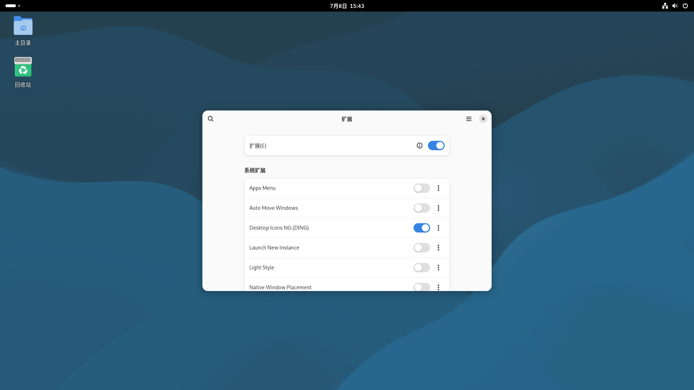
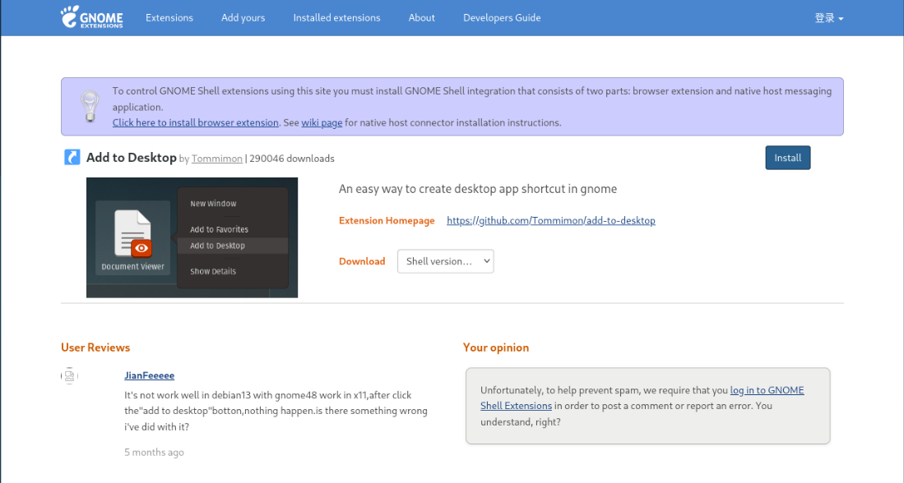

# 前言
目的：我需要桌面图标来避免按Win键来找应用，而是直接通过桌面图标实现访问
# 具体步骤
## 更新软件源和软件包
```shell
sudo apt update && upgrade -y
```
## 安装应用
```shell
sudo apt install gnome-shell-extension-desktop-icons-ng
```
出现问题如下
```shell
正在解析依赖...有错误！

......
无法满足依赖关系：
......
错误：无法修正错误，因为您要求某些软件包保持现状，就是它们破坏了软件包间的依赖关系
```
办法：换源

我用的是阿里源，换用清华源
[Debian | 镜像站使用帮助 | 清华大学开源软件镜像站 | Tsinghua Open Source Mirror](https://mirrors.tuna.tsinghua.edu.cn/help/debian/)

对sources.list备份
```shell
sudo cp /etc/apt/sources.list /etc/apt/sources.list.Alibak
```
修改内容
```shell
sudo nano /etc/apt/sources.list
```
全选删除
```MarkDown
# 基本操作步骤

1. **打开文件**：在终端中输入 `nano 文件名` 打开需要编辑的文件。
2. **设置标记起点**：将光标移动到文件开头，按下 **Ctrl+6**（或在某些版本中为 **Ctrl+^**）开始标记文本
3. **选择文本**：使用方向键将光标移动到文件末尾，选中整个文本块 。
4. **删除文本**：按 **Ctrl+K** 剪切所选文本，即可删除全部内容 。
5. **保存并退出**：按 **Ctrl+O** 保存文件，然后按 **Ctrl+X** 退出 nano。
```
然后粘贴即可
## 发现没有扩展
再次安装成功后发现根据参考文章都有扩展，而我的环境没有，安装
```bash
sudo apt install gnome-shell-extensions
```
此时显示应用里发现有扩展了。
通过重启Debian解决了
然后启动应用桌面显示图标


通过安装Add to Desktop能够将应用添加到桌面



# 参考文献
[1] [Debian13 配置 Gnome 桌面_debian13 gnome-CSDN博客](https://blog.csdn.net/ymz641/article/details/154341160)
[2] [Debian13桌面版初始配置备忘录](https://blog.admpub.com/blog/post/admin/Debian13chu-shi)