# 前言

仅作为初次学习的案例

# 抓包标定

在 Network 面板中找到目标请求，识别出动态变化的参数

## 清理缓存

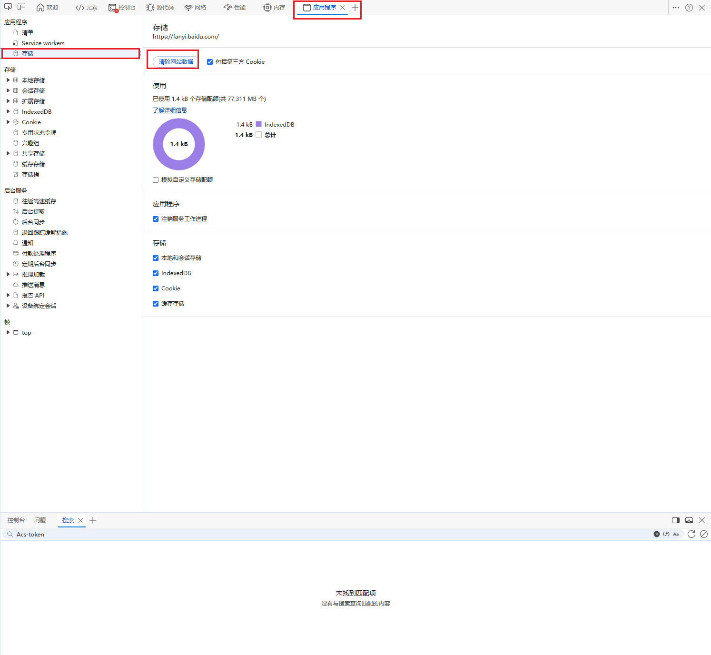
清理完缓存并刷新页面

## 寻找参数

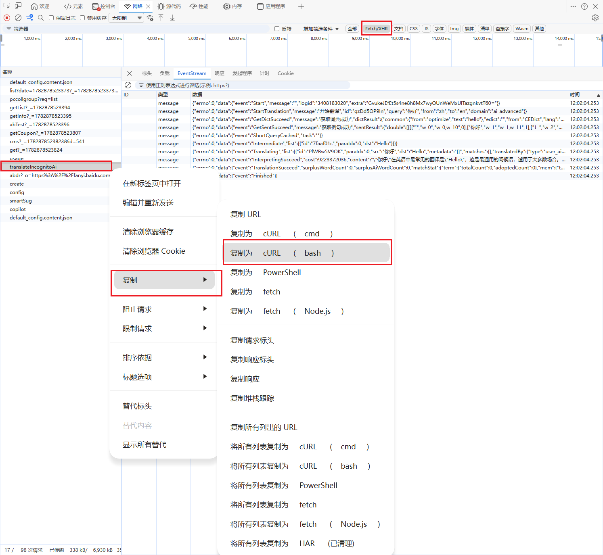
正常情况下我们需要确定接口、找到对应参数。通过复制cURL并通过第三方网址生成爬虫代码。

[Convert curl commands to code](https://curlconverter.com/)

通过修改翻译参数就能知道有两个参数是有变化的
cookies里的ab_str
headers里的Acs-Token

# 堆栈还原

通过 XHR 断点 + Call Stack，逆向追踪参数的“出生地

## ab_str

通过复制该参数的值，ctrl+f 查找，发现abdr响应该值
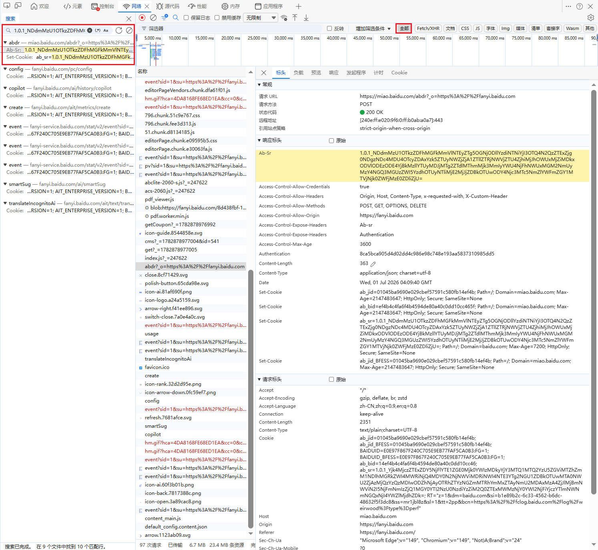
可以看到它是在响应标头里的，那么寻找如何生成该ab_sr
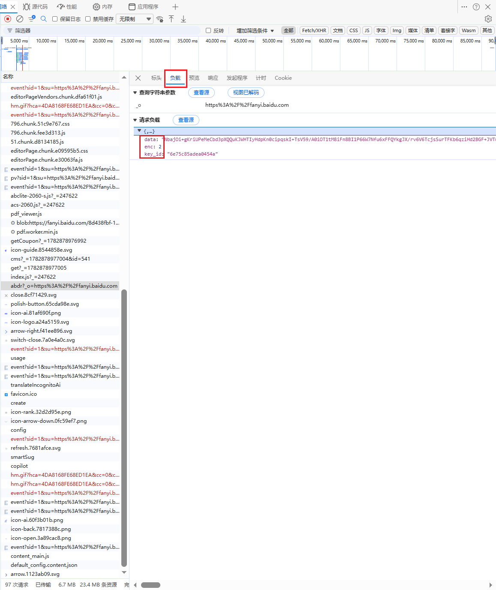
发现三个参数：data、enc、key_id

## 找到正确的“入口请求”

在 Network 面板中找到你关注的翻译接口（通常是 `translate` 或 `translateIncognitoAi` 相关的请求）。右键点击该请求 → **`Copy` → `Copy as fetch`**（或 `Copy as cURL`）。

> **这一步的目的**：你不是真的要复制代码，而是通过这个操作，让浏览器“记住”这个请求的完整信息，方便后续在 Sources 面板中精准定位。

如果网址为translate是不会定位到跟abdr相关函数的。所以断点应该要和abdr相关

```
fetch("https://miao.baidu.com/abdr?_o=https%3A%2F%2Ffanyi.baidu.com", {
  "headers": {
    "accept": "*/*",
    "accept-language": "zh-CN,zh;q=0.9,en;q=0.8",
    "content-type": "text/plain;charset=UTF-8",
    "sec-ch-ua": "\"Microsoft Edge\";v=\"149\", \"Chromium\";v=\"149\", \"Not)A;Brand\";v=\"24\"",
    "sec-ch-ua-mobile": "?0",
    "sec-ch-ua-platform": "\"Windows\"",
    "sec-fetch-dest": "empty",
    "sec-fetch-mode": "cors",
    "sec-fetch-site": "same-site"
  },
  "referrer": "https://fanyi.baidu.com/",
  "body": "{\"data\":\"NbajOi+gKriUPeMeCbd3pXQQuKJWHTIyHdpKn0cipqskI+TsV59/A0iOT1tM8iFn8BI1P66W7Nfu6xFFQYkgJX/rv6V6TcjsSurTFKb6qziHd2BGF+JVTuLTErUKRYIyzD//1C6VgNC7sALb32MkgevpBxQDHQnApLAKNuxGsOY6Ryx3fg8yagLmKzeOaBQkrNo+snDt1xtoaaP5bp0naiqD7hTa1cca7KvitqxhT+wIbfzrgRn0UHOS9Nf4ki+e/oAwr4MD34/451jy7uLynLQrq9ne6utU1j9ut8ifSIBllaX5KcHFuNMH4vFXMmxie5P93S6X5bkH6I3qO1YFctoJaT06Fvt7Rp/dGdQSuU4iiRceLwFcM5zSZjO9aqdla+kYoExszZEOAb2TW5pPhMNX8WJuCejSJtadR2HbD920z6zd3QxNxFwdmvCDJ/D+QuoUD0D4gnb4Smi8BPdJLSSEE6/Megr/o7MqVeJiM3WI2llgOENmkvp0k97bQ8dJ9TjOM5vKrGFErkVBdL34NfWYt8CN4h37xdaapZE5IBd2c/Mz/RaANVEhQ+6GewgXRlzYwS08+Es5apjsg313eaiOdwX16PTylVyTl48IIga2qunTLDbhlRZ+oZaexRh6eJL6ApjArNfEhsloUgmOike6L3xxdUDLOX3e5/4gl9EDWF0u3MINOzB360HBtCy1jxK0GJmS8ZWCIottFo9Co66+wo+PVhRwwCg4duPG6OYjYXr0lqUQS0OJZ+ouF55nDaSblBqQBv6eeoF/7MwvKO/OQPuzBM44t1cqtmZW4yG9ErEYAlwrf00Lezw8eKz7oDZ227VtAev5rUV56ippRmPn5+wQLA+MZlrZoXmqIxqW+fXvImSgbYstGmmKviWzWjv88omEJotDXa45fgidCZSS/bjvda6ZHmYxsutCP4LKqUEptf5TCB44vYcdLX9TmiGGO3G2OXP0GT29UjplQwIK/ctfXisr6g1V39EFLmURY+/SWIwAsADn6EKJy3yWaF5MCYK9jvRtv/uoLKvgjMK/JbKki/fKiul5P3lgqViY90i5cEc0ottHoApQCI/U76KOtxWHxf0gBgvgs1CGuFmGMuluUuBst0x7he/IbP07d2NYhhRofcKFctFOuvaAvcciQ1lMjqDgcIkfyG0B/AxGIQtmOiQHIbKjhRDfXWptoT+PFJ+S2GffQBLhe4eh0FmA1ZZPo0UeqHYFNI7/10s+BTqt+wXhTEn0GOvhoSTPQkpY6QNHbwIF2Xk+6hBM+afOdAQhKd0erZNcDg4uqq1ihi+pMYoyjpoWIxobenluP2Zkroga9qdNWj6+h8HXTPdQA5YpW3VeC1m6xf0FIs8M8TU0g3btxmw489IIxbTFubK7DrcSWdOI4wfLM+mBegXxXUXYycDGGrKsD4QE2t+6aq/iXJH/2Ow1Fziwmx0JDuAJTAaA4rPSP1NRx0VK1+19AgauARpUrCOLSgcXce96iQRN/rEY/kW7EpoR0lw0exGUKdbfWoqVw4R4BjeVk8jqK9ZQR2+249RlVqiK1VdLzNLqbgaeCx8/TSRkJD1f2TGyfxfXcQ73ZbPgCRqAVTRevWHXe9T2B0mcfmIFrnD5Roa6hbOrL26W7uJ+Xjbs7cen6Lgf1ZoTaTtRImNZEfPI8OcX5LB40iCmXFjV2KZ1UElNzWT5278OjRMQEQHix8XAA6c4RsNVKeLrhQaIqteYS2xTBJoWzFEqcbVJ9kMjGyUv8d9EeHGtqFyoD8DhWYLKgqdyBsd2r/jfDIA6oF6YF7aSniM1c9UHA7x2pkdO35sBMIlg44LXJ+xpIobU5uS5zbT+BPSU9FnJ9QOIlQTVZ1MeLxrfuQw7xjWJNJ1FyZrR4T4tBbCNFSpMvpeX2QD8KWlS6YGpbQK7YDGC6A48EJuC8DKHkNwZISeWj5FKBQ+YcqVHXnUlk7KqIFM3mRJfak/ccT2rQ82Ad30IHNhttUPabhbPJInZfm5zhQMnaX2Fk2tr2d4JDM5MkFTJavXZbpiHBSY5aJg3NqMjiAbwqYwz3J0cZuHUk7u+DU2IQ/q4gbNxNHwLOn1oI6lzf7nWtLz/i1kjDIDnwD7wE0xB4ueDYRjku66PkoovCt2Y90ATnxFpxEP5IXsqaNhMZWf7/4s/j3b26ivVNglgYz7cpXOBkvGHoO1WS9HZc+BoVeOULN6TTBE2pIdQsCQm7eWsVJUERYCkRncKOsRNcFxzeJLT/Cfl7fehcqM8a3qQOTo99m0s/V8DM16WaiVvrJHFzKZTnyEjpnUx4iCo\",\"key_id\":\"6e75c85adea0454a\",\"enc\":2}",
  "method": "POST",
  "mode": "cors",
  "credentials": "include"
});
```

## 设置 XHR/fetch 断点（这是“跟进去”的关键）

切换到 **Sources（源代码）** 面板。在右侧找到 **`XHR/fetch Breakpoints`** 区域，点击 **`+`** 号按钮。

在弹出的输入框中，粘贴你刚才复制的 URL 中的**路径片段**——比如 `/api/trans` 或 `translate`（不需要完整 URL，只要能唯一标识这个请求的关键词即可）。

> **这一步的作用**：相当于在“发送请求”这个动作上装了一个“监控摄像头”。只要页面发起匹配该路径的请求，执行线程就会**自动暂停**，让你看到请求发送那一刻的所有现场信息。

## 触发请求，观察 Call Stack（调用堆栈）

刷新页面或重新点击翻译按钮，触发请求。代码会在你设置的 XHR 断点处**自动暂停**。

此时，看右侧的 **`Call Stack`（调用堆栈）** 面板。调用栈是一个**从下往上**的函数调用链——最下面是最早调用的（入口函数），最上面是当前正在执行的（发送请求的函数）。
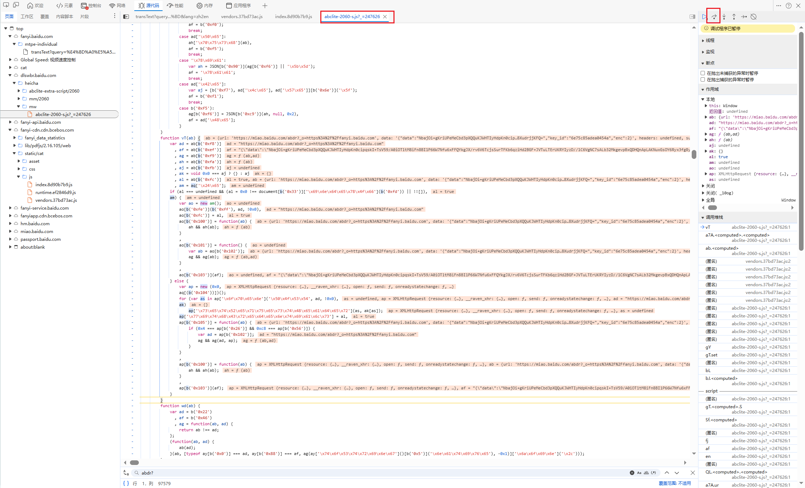

## 顺着调用栈“往下点”，找到加密逻辑所在的文件

**关键操作来了**：在 Call Stack 面板中，**从下往上**（或从中间开始）逐个点击函数名。每点一个，左侧代码区域就会跳转到对应的 JS 文件位置。

你要找的是**文件名包含 `abclite` 或 `2060` 的 JS 文件**[](https://blog.csdn.net/kdl_csdn/article/details/156192019)。当你点击某个栈帧，左侧代码区域跳转到一个名为 `abclite-2060-s.js` 或类似名称的文件时——**恭喜你，你跟进去了**。

> **为什么是“从下往上”而不是“从上往下”？** 因为调用栈的底部是业务入口（比如点击事件处理函数），顶部是底层网络 API（比如 `fetch`）。加密参数的生成通常发生在**中间偏下的位置**——在业务逻辑被调用之后、在请求被发送之前。从下往上点，能更快扫过工具函数和框架代码，找到业务加密逻辑所在的那一层。
> 

（带有 2060 的都是和加密算法相关的文件，当年这个数字上有一行注释，"渠道号，由管理员分配"，这么多年，还没改过）
注意看ab那里是传递了url，

## 逻辑还原

在定位到的 JS 文件中，分析加密/签名算法的具体实现
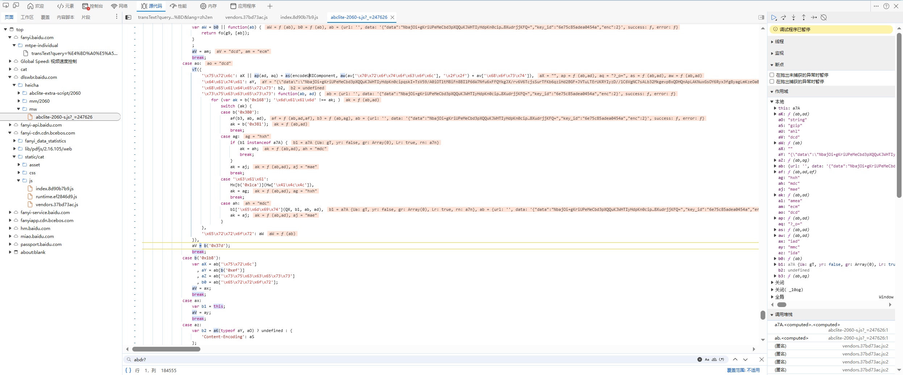
没有反混淆确实不太好定位，对vT下断点
继续跟栈发现aj就是要的data参数且经过uH(ad)生成。那么我们需要分析uH函数和ad

通过双击ad右键“估算控制台中的所选文字”能够更好地观察参数
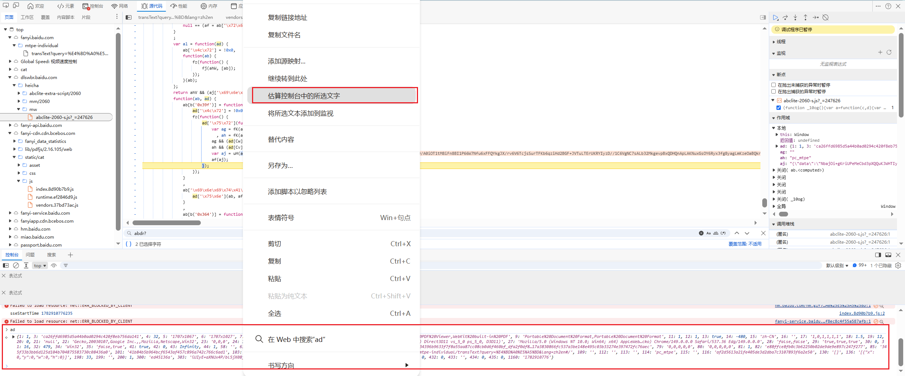

没跟到uH函数导致错过了，通过对本文件进行搜索并添加断点。在重刷页面的情况下中断到有关函数。
其中key_id已经由aj参数来验证
而data我不太懂，具体见参考文章，由于uH(ab, ad)所以研究ad的参数生成
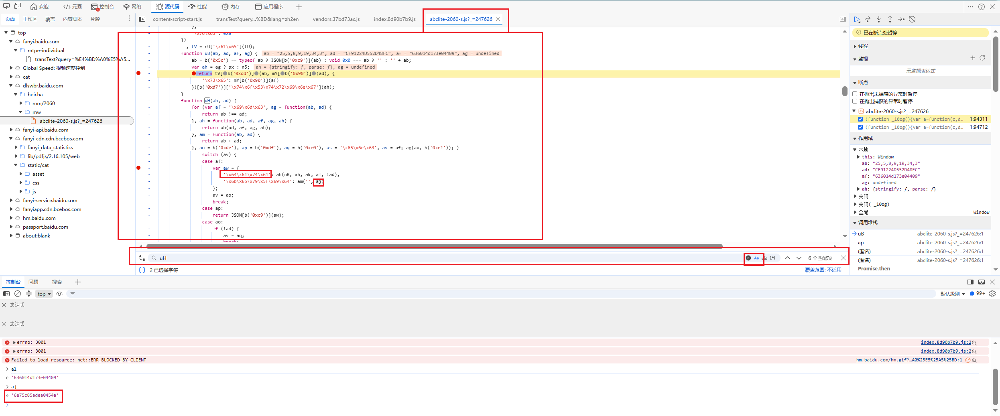
学到这里我不知道为什么要观察这里了
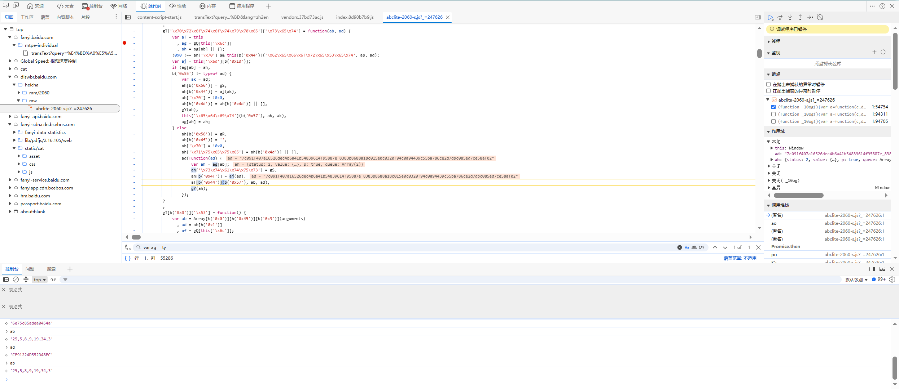

## 代码复现

将算法用 Python/Node.js 重写，集成到你的爬虫中

# Acs-Token

## 设置断点

```
fetch("https://fanyi.baidu.com/ait/text/translate", {
  xxxxxx
});

```

跟栈到该文件，设置断点，我们要找的就是headers里的Acs-Token字段，所以直接对如此明显的v参数进行打印，发现Acs-Token参数已经生成。
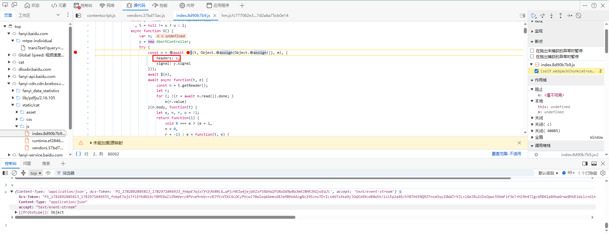

## 跟栈

初学者最大的误区：**试图读懂每一行代码在干嘛。** 正确的操作是：**你只盯着那个参数值（Acs-Token），看它从“undefined”变成“有值”的那一刻，发生在哪个函数里。**

1. **关键机械动作**：看右侧 **`Scope`（作用域）** 面板，展开 **`Local`（局部变量）**。你会看到一个变量（比如叫 `e` 或 `t`），它里面有一个属性叫 `Acs-Token`，且已经有了长长的值。
2. **你现在的位置**：数据已经“装车”了，但你要找的是“生产车间”。所以，**不要看当前这行代码，盯着这个包含 `Acs-Token` 的变量名**（假设叫 `params`）。

严格遵守以下**唯一规则**：**只看 Call Stack（调用堆栈）面板，从下往上数，每隔 2~3 层点一个函数名看。**

每点一个函数名，立刻做 **“Ctrl+F 搜索”**（在左侧代码区按 Ctrl+F），搜索框里输入 **`Acs-Token`**（带引号）。

- **如果搜不到**：说明这一层只是把参数对象传下去，还没生成，继续往上（更早的调用）点。
- **如果搜到了**：看搜索结果。如果出现在**等号左边**（例如 `params.Acs-Token = xxx`），**立刻在这一行打上断点**，刷新重来。
- **如果搜不到，但你在 Scope 面板里看到了这个值**：说明这一层就是“生产车间”的出口，**在这一层的函数开头打断点**，刷新。

如果按第二步在堆栈里搜遍了都找不到 `Acs-Token` 的赋值语句，说明它根本不是在同步堆栈里生成的（正如文章所说，它涉及 SSE 或 Promise 异步）。

**此时放弃堆栈，改用“全文件搜索”**（这是初学者最该学但最常忽略的操作）：

1. 在 Sources 面板的左侧文件树里，**右键点击最顶层的域名（比如 `fanyi.baidu.com`）**，选择 **`Search in folder`（在文件夹中搜索）**。
2. 搜索框输入 `Acs-Token`（注意大小写，带上横杠）。
3. 搜索结果显示，所有包含这个字符串的 JS 文件都会列出来。
4. **重点看搜索结果中，哪一行是 `Acs-Token: ...` 这种对象属性写法，或者哪一行有 `setItem`、`append` 等操作**。点进去，那里就是你一直在找的“生成逻辑”真正所在地。

跟栈到a发现t是我们要的参数，继续跟栈
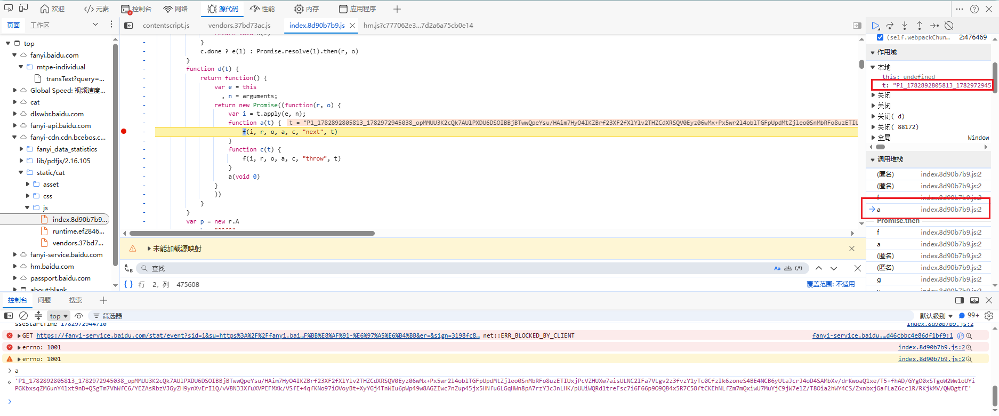
多次跟丢后，重新刷新在进行单步跳过，发现参数在t.sent。跟参考文章不一样。
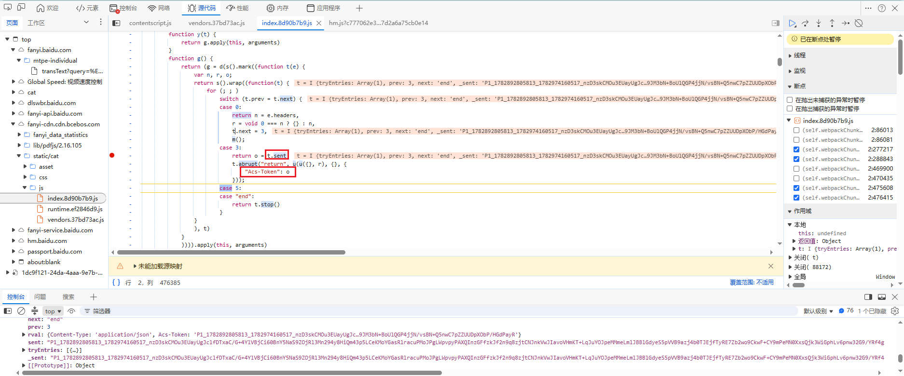
由于卡住了，又和文章不一样的，现在询问DeepSeek
跟着Ai到这一步了
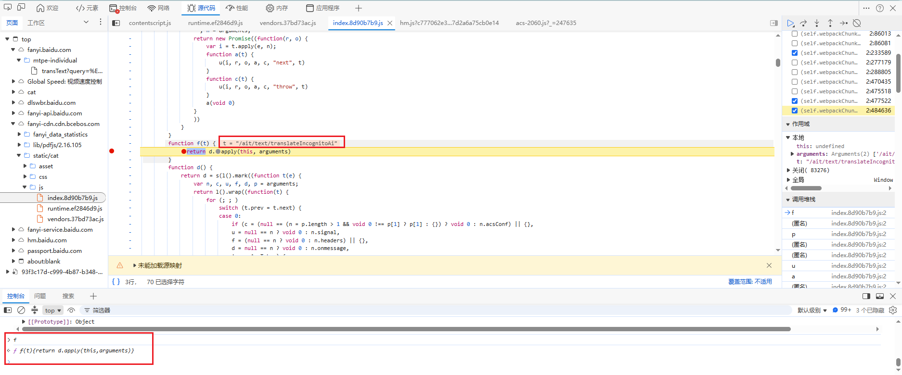
通过不断跟栈和进入函数，最终得到v函数是生产车间
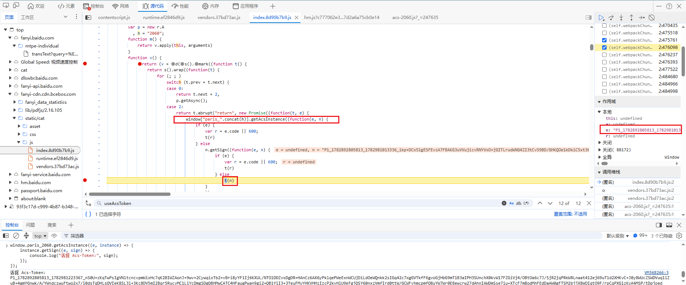
这里也能断到n.getSign。

- `var T = function(e)`：这是一个名为 `T` 的类，它**继承**自父类 `b`。
- `r.getSign = function(e, t)`：这就是你之前一直在调用的 `getSign` 方法。
- **关键结论**：`getSign` 本身**并不计算** Token。它只是一个“调度室”：
  1. 计算耗时（`c()`）。
  2. 调用 `this.getTarget`（从父类 `b` 那里拿一个“工具箱”）。
  3. 拿到工具箱 `n` 后，调用 **`n.gs`** 方法，并把最终结果传给你。

**也就是说：真正的 Token 生产车间，在你还没看到的 `n.gs` 里面！**
进入gs
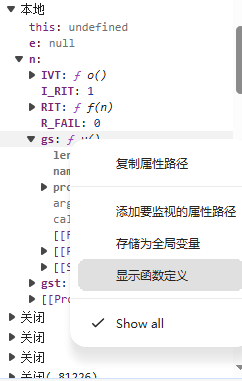
成功抵达acs-2060.js文件

理思路：n.getSign((function(e,n)) ->n . gs -> var n = r.W(i , v)

根据AI，现在卡在VMP里了。暂时不继续了。
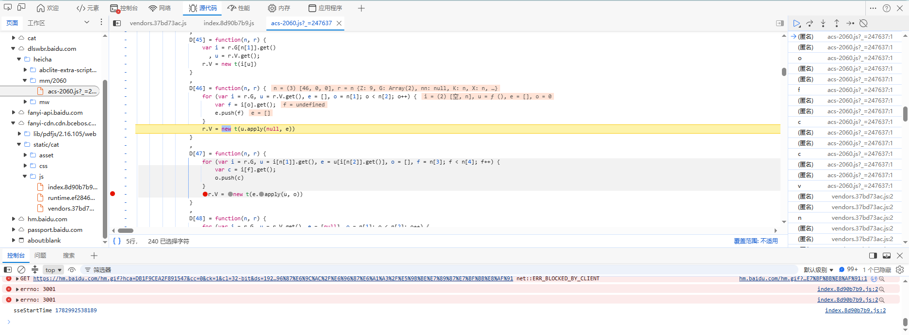

# 参考文章

[【JS逆向百例】某度 Acs-Token、ab_sr 逆向分析](https://mp.weixin.qq.com/s/5rKuevOhsFCCtFcg4DIWvA)
