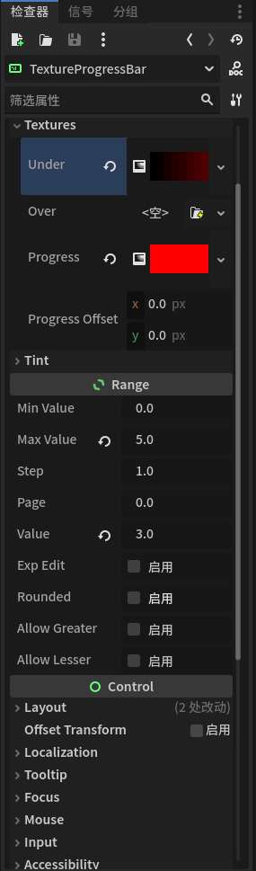
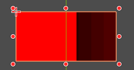

# 前言
由于做像素游戏的情况下，发现实现简单的血条。
用Label.text在具体游戏中会模糊。
那么就有两种方案
1. 找像素字体或者支持8px左右的低像素字体
2. 通过Control节点对Sprite2D进行控制实现
3. TextureProgress
由于我没有用过TextureProgress，所以本文用TextureProgress实现

参考文章：[【Godot 3.5控件】用TextureProgress制作血条_godot 血条-CSDN博客](https://blog.csdn.net/graypigen1990/article/details/136924505)

# 具体步骤
OK，简单实现就是
创建texture_progress_bar节点

由于我暂时只会使用GradientTexture2D类型所以直接使用
如下

根据情况修改属性。其中修改value实现progress效果。
那么只需要在代码中修改value得到相应效果。
成品
