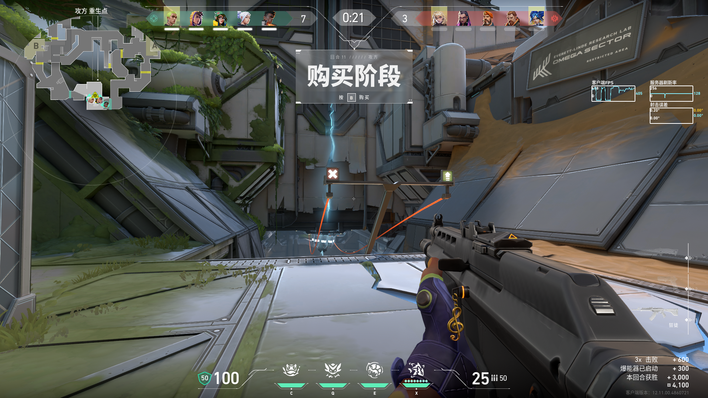

游戏时长：2h（总时长223h）
进度：未定级还需要完成3场比赛
从夯到拉评价：NPC
# 前言
  我已经很久没玩了，这两天再次游玩。
# 整体初印象与总评
  用 3 个以内的关键词概括这款游戏给你的整体感受，你对它的总体评价是正面、中性还是负面？核心的加分 / 减分项是什么？
  
  关键词：电子竞技、FPS、5V5对抗、角色策略
  
  总体评价：这是一款拥有丰富的技能决策的FPS竞技游戏。主要的核心体验就是每个人分工明确地赢下比分。

加分项：
1. 强烈的分工：每个人会扮演团队竞技中的4个角色进行游戏体验，不同的角色将有不同的价值。也容易让人快速上手。
2. 技能组合：游戏的丰富度随着不同的角色推出，不同的技能搭配，会有丰富繁多的游戏决策出现。
3. 游戏角色互动：IP化，不同的人物互动让你觉得你的游玩体验是真实的，即增加沉浸感

减分项：
1. 技能多：技能过多会导致学习成本较高，虽然大部分技能通过抽象能够归一种类别，但是技能会有不同的权重比如CD、速度、覆盖面等。那么针对不会技能的人，要思考很多道具的反制手段，自身反抗和理解的学习成本跟随提升。
2. 游戏环境：我觉得相对来说比较严重了，普通模式压力比较大，这很奇怪欸，普通模式也压力人。但是任何一个FPS都无法幸免。
3. PVE低：这里指的一个人游玩的游戏体验，我这次上号发现仅一个好友在线。那么和路人队友进行竞技，由于强烈的角色分工，比如盖可，我只能够扮演辅助道具手和补枪手，是不能够成为突破手，不能玩的随心所欲。

# 核心玩法体验
（最爽的地方 / 最难受的地方）

核心玩法，它的核心玩法是剧情。其他方面总的体验来讲是辅助和拓展因素。

最爽的地方：
- 回归基本功，依旧是FPS，最终会以对枪的形式作为核心体验。
最难受的地方：
- 分工明确和学习成本高吧。作为盖可也不能打第一身位，又不怎么起冥驹玩，还要应付对面各种技能。容易通过技能来使游戏不平衡。
# 长期游玩体验
随着游玩时长增加，你对这款游戏的兴趣是上升、持平还是快速下降？你觉得影响你持续玩下去 / 想要弃坑的核心原因是什么？

快速下降。

  核心原因：我只能扮演我该扮演的角色，击杀反馈不是很强烈，赢了就是赢了，无太多激情，虽然结束后会以游戏角色互动夸赞，但整个游戏体验较闷，且地图设计不是很好，很多位置不好体验。

# 游玩动机与情绪价值
  你玩这款游戏最核心的诉求是什么（比如策略成就感、消磨时间、剧情沉浸、社交互动、操作爽感等）？它有没有满足你的预期？游玩过程中正面情绪和负面情绪的占比大概是多少？

最核心诉求：社交互动。玩瓦的人从国内来讲是较多的，但游玩体验下来，还是回归纯粹吧。

正面情绪和负面情绪的占比：4/6
# 横向对比与最终定位
和同类型热门游戏 / 系列前作相比，这款游戏最大的优势和短板分别是什么？最终你会给它一个怎样的游玩定位（比如必玩、可玩、避雷）？
直接和CS相比吧
最大的优势：
- 标签化。角色有标签，玩家有标签，被定义的感觉相对较重。无可厚非他令人快速上手，每个人都做了该做的。但实际上团队游戏都有潜在分工，只是无畏契约更明确。（当Dust2队友喷你战绩低时候，我是B点主防，回回打残局1打多被缴枪导致战绩差，你怼什么？所以玩游戏清楚自己干什么就好）
最大的短板：
- 游戏环境和学习成本：技能是真多，虽然回归的我还能应付，但太多了，不会用啊。然后团队氛围闷闷的，击杀反馈没什么感觉了。

由于我是CS玩家，
- 道具直接。在道具仅有雷、烟、火、闪、诱饵弹，反制手段较为明确，相关信息一目了然。
- 团队分工。模糊是比较好的，游戏控图是需要去做的。可以打突破，打道具，打断后，而且死了影响不大。但无畏契约一个道具角色掌握重要的进点道具第一个死了，整个队伍的进攻权重会明显降低且困难增加。
- 移速。很少有FPS游戏如此大胆地设计成这个移速，感觉无畏契约是不会引入野牛这类机制的枪械。且爆头权重增加，鼓励点射。
# 结语
  本文仅针对竞技模式，略带一点休闲模式。
  大抵是不会再二次游玩，除非有朋友的情况下。